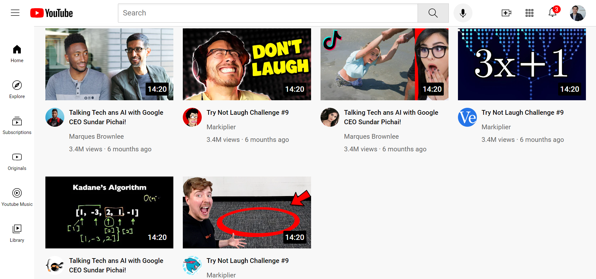

# YOUTUBE Clone  

This is a YouTube clone project I created last year by following a tutorial on YouTube.
 

## Technologies Used  
- **HTML**: For the structure of the webpage.  
- **CSS**: For styling and responsiveness.  

## Preview  
Here is a screenshot and link to the live version of my project in github [Click here](https://moussahl.github.io/YOUTUBE-Clone/youtube.html).
 

Here is the link of the Tutorial if someone need it [Click here](https://www.youtube.com/watch?v=G3e-cpL7ofc).
 
 
